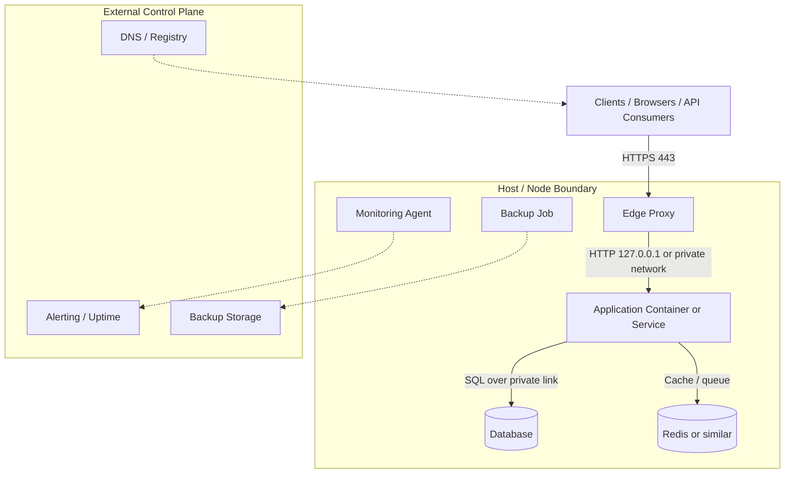

# Architecture Overview

This section describes a pragmatic production topology for a single Linux host or a small cluster. The goal is not to model every possible deployment pattern. The goal is to make trust boundaries, traffic flow, and operational ownership obvious.

## Topology

## Trust Boundaries

1. `Clients` are untrusted by default. Only the edge proxy should face the public internet.
2. `Edge Proxy` is the first policy enforcement point. TLS termination, rate limits, request size limits, and routing happen here.
3. `Application` should be treated as internal traffic only. Bind to `127.0.0.1` or a private subnet unless there is a strong reason not to.
4. `Database` and `Cache` should never be publicly exposed. They live behind host firewall rules and private networking.
5. `Monitoring` and `Backup` are control-plane functions. They must observe the system without becoming part of the request path.

## Traffic Flow

Normal request path:

1. Client resolves DNS.
2. Client connects to the edge proxy on `443`.
3. The edge proxy terminates TLS and forwards to the app.
4. The app reads and writes to the database or cache.
5. Logs, metrics, and traces are emitted asynchronously.

Operational traffic path:

1. Operators access the host over SSH or a bastion.
2. They inspect service state through `systemd`, logs, and metrics.
3. Backups and maintenance jobs run from timers or controlled scripts.
4. Alerting reports the result back to the on-call channel.

## Deployment Principles

1. Prefer stateless app containers and externalized state.
2. Keep ports private whenever possible.
3. Use the host firewall as a second enforcement layer, not the only layer.
4. Separate runtime traffic from management traffic.
5. If a component can be replaced without data loss, make that explicit in the topology.

## Operational Signals

- Public traffic should only hit the edge proxy.
- App ports should usually listen on loopback or a private interface.
- Database ports should be private and backed by volume or managed storage.
- Monitoring must read from the system without requiring the request path to stay healthy.
- Backups must be out of band and verifiable with restore tests.

## Components

1. **Edge layer:** Nginx, Traefik, or a cloud load balancer. Handles TLS, routing, and request shaping.
2. **Application layer:** Docker containers or systemd-managed services. Runs business logic and should stay stateless.
3. **Data layer:** PostgreSQL, MySQL, or similar. Owns durable state and needs backup and retention policy.
4. **Cache layer:** Redis or a queue backend. Holds transient data and should degrade gracefully.
5. **Management layer:** Monitoring, backup, and audit tooling. Must not become a dependency for serving requests.
